# PacePaper

[](https://buymeacoffee.com/gowanginc) [](https://www.paypal.com/cgi-bin/webscr?cmd=_donations&business=nicholasjgowan%40gmail.com&currency_code=USD&item_name=Support%20PacePaper&no_shipping=1)

PacePaper stays free for classrooms. If it saves you an afternoon of exam-prep admin, the beans are appreciated — every cup goes straight to the developer. ☕

PacePaper is a local-network workspace for supervised examination practice and candidate familiarisation. Teachers prepare papers and classes, students complete timed practice sessions in a focused browser workspace, and teachers review the saved responses afterwards. Its provider-neutral profile system currently supplies researched practice starters and original demonstrations for IB DP, IB MYP eAssessment, Cambridge IGCSE, Pearson Edexcel International GCSE, and selected AP formats in the same application.

PacePaper is an independent school-practice tool. It is not an official examination-delivery system, is not affiliated with or endorsed by the International Baccalaureate, Cambridge University Press & Assessment, Pearson, College Board, ACT, or any other awarding body, and should not be used to deliver live high-stakes examinations.

## Try PacePaper in two minutes

**Download the latest demo** for Windows or Linux from the [releases page](https://github.com/GowangInc/PacePaper/releases). Extract the archive, open `PacePaper.exe` (Windows) or `PacePaper` (Linux), and your browser opens the teacher dashboard automatically. There is nothing to install — no Bun, no server setup, no internet connection required. Mac users can run the current source with `Start PacePaper.command` after installing [Bun](https://bun.sh/).

On first launch you sign in with the default teacher login **`admin` / `admin`** (change it any time from the **Settings** section), and the Paper library already contains one preloaded **Sample paper** with no subject or IB branding. Open it, start a session, and you can try the whole workflow immediately — classes, timed phases, the candidate view, autosave, focus alerts, and printing — without creating anything first.

One plain-language document ships beside the app and is linked from the teacher dashboard: the illustrated **User guide** (click *User guide* in the sidebar) walks through every classroom task.

## See PacePaper in action

The same workflow on a fresh copy — what the teacher sees first, then what a candidate sees on their own device.

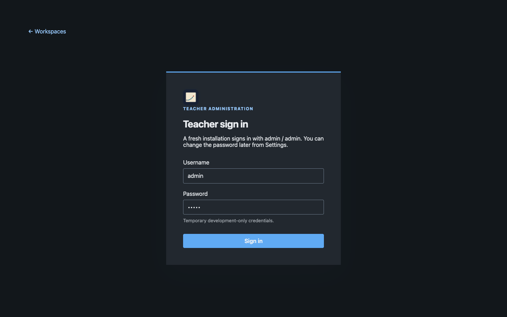

Sign in on the teacher computer with the default demo login.

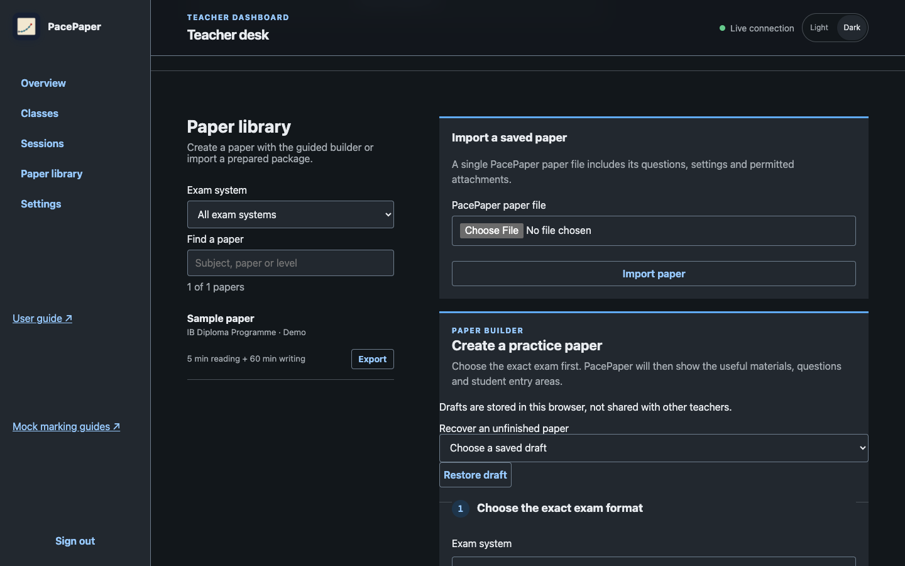

The Paper library already holds one preloaded Sample paper, ready to open — plus the builder and import for your own papers. **Preview as student** opens any paper in the candidate interface.

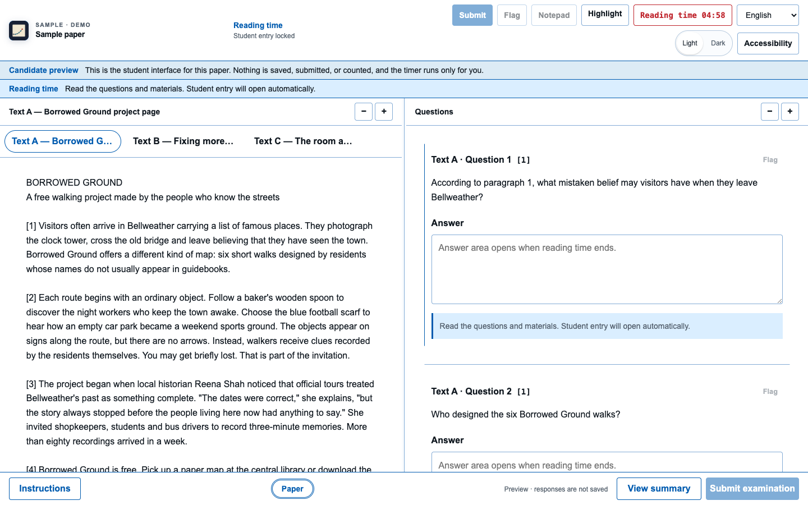

A candidate preview: the real student interface for the chosen paper, with nothing recorded.

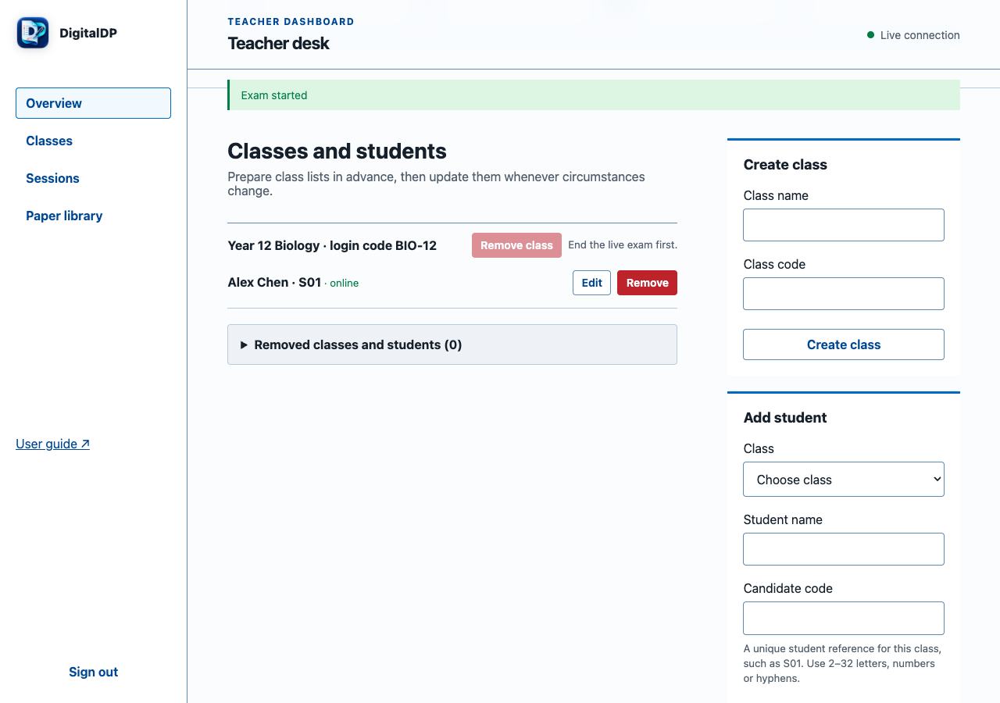

Classes keep rosters, candidate codes, and extra time together; this sample class has two students.

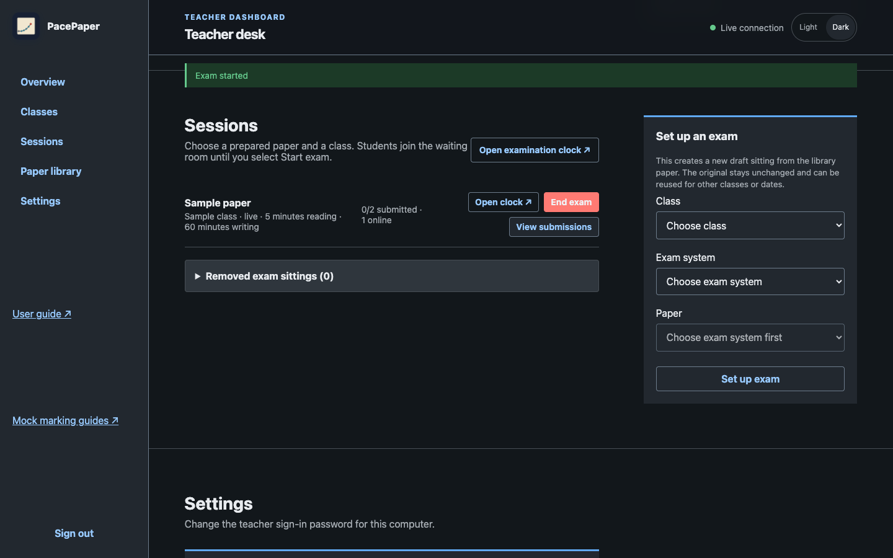

Start the exam from Sessions and watch it live: who is online, how many have submitted, and the reading and writing time.

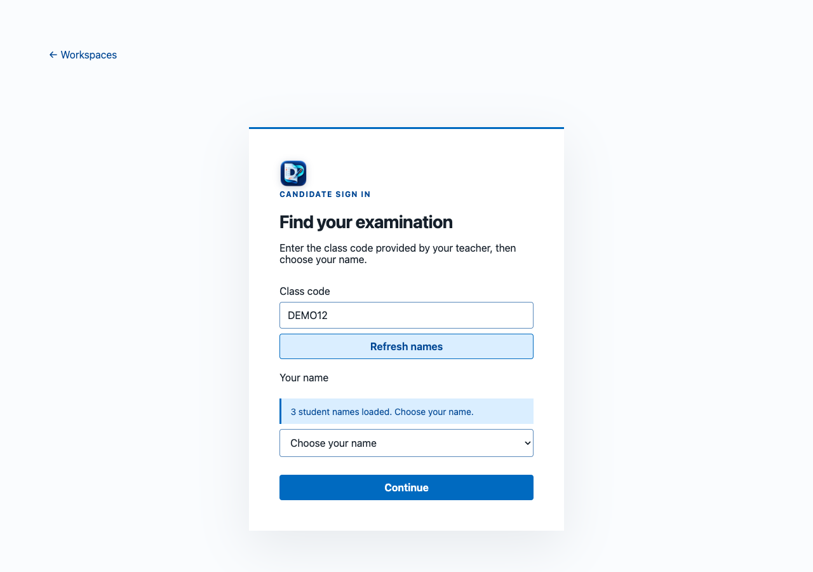

On their own device, a student enters the class code, then chooses their name.

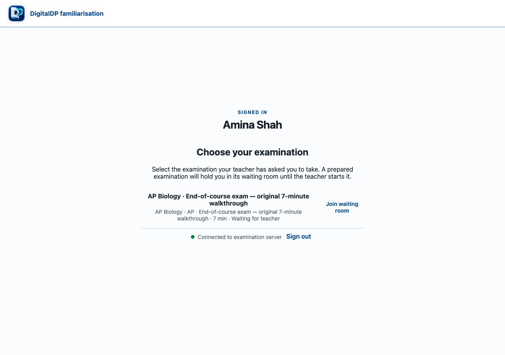

The student confirms the paper the teacher prepared and joins its waiting room.

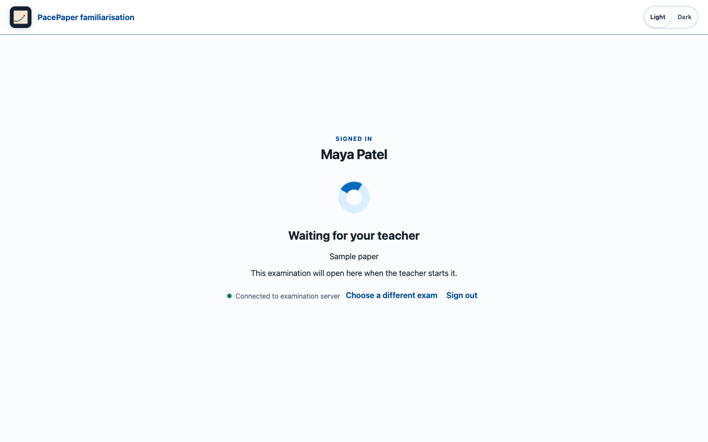

Until the teacher starts the exam, the waiting room shows the student is connected and ready.

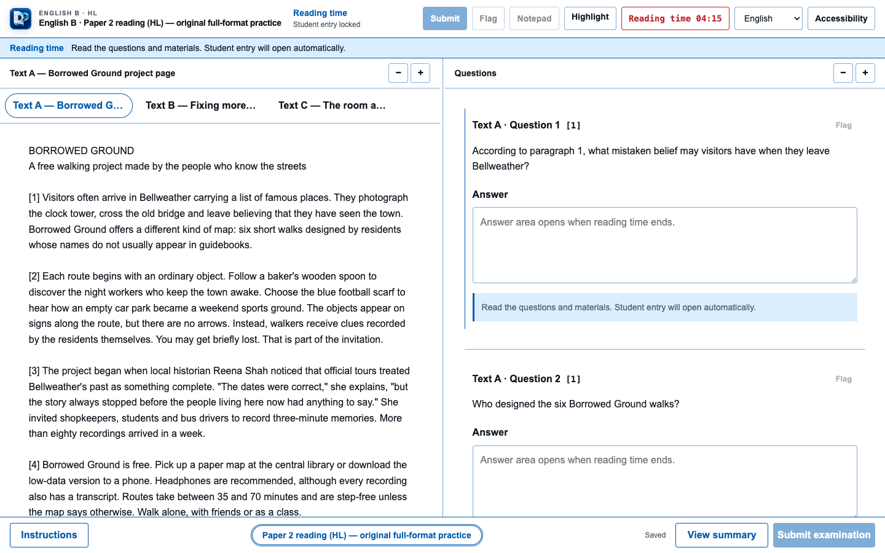

In reading time the paper opens with its texts and questions visible; response areas stay locked until writing begins.

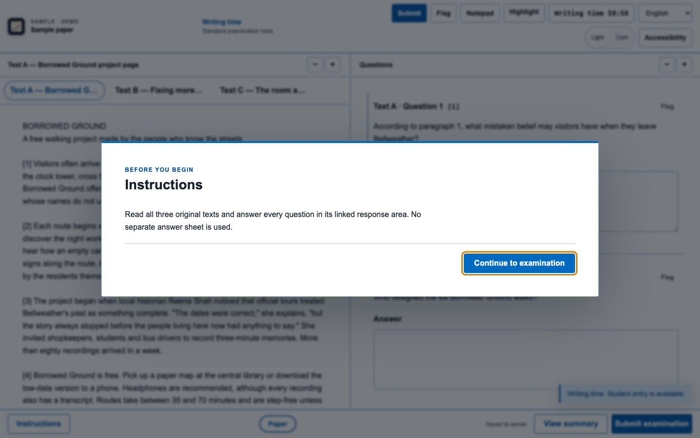

In writing time the response area opens under each question, and answers autosave as the student types.

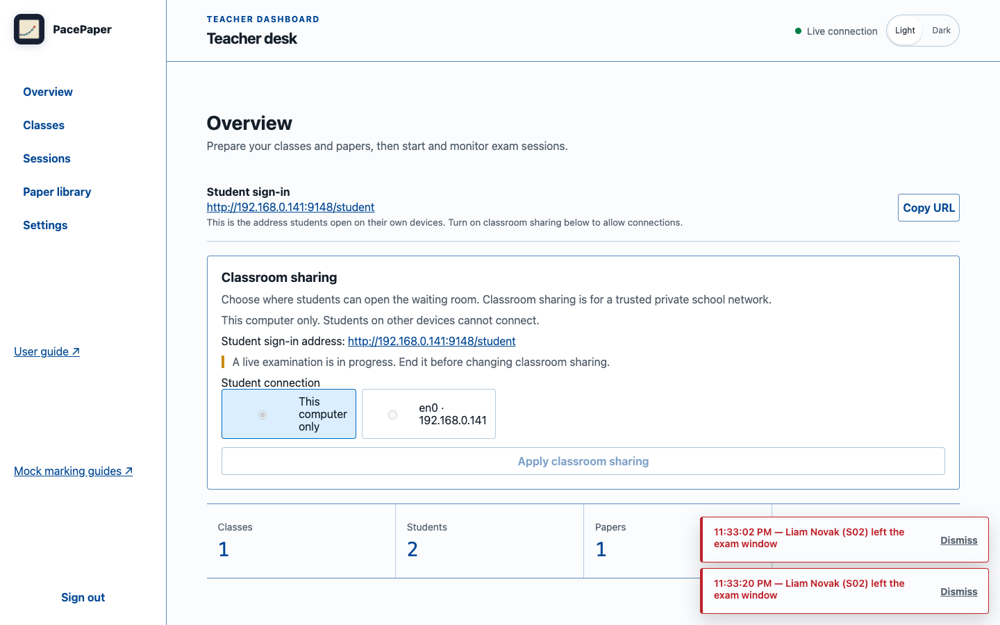

If a candidate leaves the exam window, the teacher dashboard raises a focus alert immediately and records it in the sitting's audit trail. Right-click menus are suppressed on PacePaper controls during an exam.


## Using PacePaper with a class

1. **Prepare.** Sign in on the teacher computer and choose **Settings** to set a password you will remember.
2. **Add your class.** In **Classes and students**, create a class and add candidates (or import a CSV class list). Students see their own name at sign-in.
3. **Choose a paper.** The preloaded **Sample paper** demonstrates the app. For real practice, build a paper in the **Paper library** with the guided builder (it follows the format of your chosen exam system) or import a prepared PacePaper paper file.
4. **Set up an exam.** In **Sessions**, choose the class and paper. Students open the **Student sign-in** address on their own devices (the bare address is enough — it opens candidate sign-in), enter the class code, and choose their name. Check that address under **Classroom sharing** on the teacher dashboard — PacePaper shares the classroom network by default, and you can choose another detected address there if the network changed.
5. **Run the exam.** Click **Start exam** when candidates are ready. The exam clock, per-candidate progress, and **Focus alerts** (candidates leaving the window) are on the dashboard; open the **examination clock** on a second screen to project the countdown. Responses autosave, and the exam submits automatically at the deadline.
6. **Review.** Open a session's submissions to read, print, or save each candidate's complete paper as a PDF.

Notes for teachers:

- **All data stays on the teacher computer** in the per-user application-data folder (the exact location is in the User guide). Nothing is uploaded. Back up that folder after each sitting — the guide shows how.
- **Students need only a browser** and a connection to the same network; no app, account, or internet access is needed during the exam.
- **Change the look per device.** Teachers and students each have a **Light/Dark** toggle (teacher: top-right of the dashboard; student: their pages), and each person's choice is remembered on their own device.
- PacePaper is for **practice and familiarisation** — never for live official examinations — and the bundled materials are original practice content, not official papers.

## Current capabilities

- Teacher sign-in on this computer: a fresh installation uses `admin` / `admin`, and the password can be changed from **Settings** (it is saved with your data and survives restarts; teacher sessions clear on each launch)
- Classes, class-code/name sign-in, candidate codes, individual extra time, CSV class-list import/export, and reversible roster archiving
- Exam-format-first Paper Builder with provider-specific terminology and tuned starters for IB DP, IB MYP eAssessment, Cambridge IGCSE Mathematics 0580, Pearson Edexcel International GCSE Mathematics A, selected 2027 AP formats, and school-custom practice
- Video and YouTube stimulus material: paste a video link as a shared paper material or attach one to an individual question; candidates see an embedded player (YouTube plays via youtube-nocookie; direct https video URLs stream inline)
- Full-screen suggestion on the candidate exam screen: one click enters browser full screen, the suggestion returns if full screen exits, and an explicit dismissal is remembered for the sitting (no-op in SEB or managed-kiosk full screen)
- Rehearse a paper as a student before a lesson: **Preview as student** in the Paper library opens the real candidate interface in a new tab, with the paper's own timings, phases, locked sections, and audio — and records nothing at all (no class, session, response, or counted audio listen)
- Live, independently scrollable paper preview while a teacher edits
- One-file PacePaper paper export and re-import, including explicitly authorized attachments
- PDF, image, text, and controlled-play audio resources, including media attached to individual questions; students receive exactly two complete plays per recording, with no pause or restart once a play begins
- Legacy reading-then-writing timing plus multi-section phase plans with locked reading periods, fixed monitored breaks, no-return section boundaries, phase-specific tool rules, and extra time applied to the final work phase
- Second-screen countdown with fullscreen mode and authoritative linked timing; simple-exam reading and writing minutes can be corrected from the clock while the exam is ready or live (fixed-section and ended exams stay read-only)
- Editable student-name roster on the second-screen clock, without changing student accounts or authoritative timers
- Visible student sign-in address with a copy action on both the teacher dashboard and projected clock
- Timed sessions with autosave, local unsaved-work recovery, and automatic deadline submission
- Student exam selection after sign-in, with per-exam waiting rooms and completed sittings kept separate from new sessions
- Reversible removal and restoration of classes, students, and exam sittings without deleting saved candidate responses
- Rich-text, short-answer, single-choice, and expandable digital-ink responses with blank, ruled, or square-grid pages, Draw/Eraser tools, and Undo/Redo
- Page context menus suppressed on PacePaper interface controls while normal clicks, keyboard controls, and text selection remain available
- Event-driven teacher status updates that preserve active form controls, plus printable/PDF candidate submission review
- Focus-loss notifications: when a candidate leaves the exam window, the teacher dashboard raises a live alert naming the student and keeps a per-sitting audit trail (best-effort — a crash or disconnect can prevent an event)
- Branded native application icons for macOS and Windows, plus Linux and browser icon assets
- Teacher **Settings** section: change the saved teacher password (current password required; all devices sign out afterwards)
- Light and dark appearance, chosen independently for the teacher dashboard and the student pages and remembered per device
- Illustrated offline user guide accessible from the teacher sidebar

## For developers — run from source

PacePaper requires [Bun](https://bun.sh/).

Install Bun and run `bun install` once from the project folder. For the simplest app-style source run on a Mac, double-click `Start PacePaper.command`. On any supported platform, open a terminal in the project folder and run:

```sh
bun run start:app
```

This uses the same per-user data folder and classroom-sharing controls as the packaged app, safely adds any missing PacePaper examples, chooses an available port, and opens the teacher dashboard. Keep the Terminal window open while PacePaper is running; press Control-C there to stop it.

For development and tests:

```sh
bun install
bun run check
bun test
bun run dev
```

The development server listens on `127.0.0.1:9148` by default. `public/index.html` is the application shell, not a standalone page: start the server and use `http://127.0.0.1:9148/` instead of opening the file with a `file://` URL. A fresh installation signs in with `admin` / `admin`; the password then persists and can be changed from dashboard **Settings** (teacher sessions are cleared on each launch). Open `http://127.0.0.1:9148/admin` to sign in. Use the same address consistently in that browser.

## For developers — build the desktop releases

The release builder produces shareable, self-contained macOS, Windows, and Linux bundles. They use the normal browser for the existing teacher dashboard and printing workflow; Bun, Node.js, the source checkout, and `public/` folder are not required on the recipient computer.

The Mac bundle must be signed with a Developer ID Application certificate and notarized by Apple. The release builder deliberately refuses to create an ad-hoc-signed Mac download, because Gatekeeper can report that download as damaged without offering **Open Anyway**.

**Version 0.1.0-demo.12 is prepared for Windows x64 and Linux x64** — a teacher can now rehearse any paper as a student: **Preview as student** in the Paper library opens the real candidate interface with the paper's own timings, phases, locked sections, and audio, and records nothing. It keeps demo.11's classroom address chosen from a real network adapter rather than a container or virtual adapter, so a machine running Docker, Hyper-V, or WSL advertises the interface that student devices can actually reach. It keeps demo.10's classroom sharing active from launch, demo.9's teacher **Settings** area, independent **light/dark themes**, the **IB MYP eAssessment** exam system, **video and YouTube stimulus material**, and the candidate **full-screen** suggestion, plus the demo-era strengths: live reading/writing timing corrections from the examination clock, focus alerts when a candidate leaves the exam window, and one generic **Sample paper** so a fresh install is usable immediately. A macOS app remains withheld for signing/notarization reasons; see [release notes](release/RELEASE_NOTES-0.1.0-demo.11.md).

Once the signing and notarization credentials described below are available, run `bun run release:build`. The generated archives, standalone user guides, and checksums are placed in `release/`. On macOS, use the notarized `macos-universal` archive for both Apple-silicon and Intel Macs; extract the correct platform archive and start its PacePaper app or executable. The macOS bundle and Windows executable carry the PacePaper icon; the Linux archive includes the matching PNG for desktop integration. A packaged release automatically opens the teacher dashboard on the first available local port from `9148` through `9158`, so the address may be different from `9148` when another local instance is running. The initial release is intentionally offline: it makes no licence, activation, telemetry, or other network call. See the illustrated teacher-facing [`USER_GUIDE.html`](USER_GUIDE.html), its editable [`USER_GUIDE.md`](USER_GUIDE.md) source, and [`release/README.md`](release/README.md) for concise install, storage, signing, and classroom-sharing notes.

### macOS release credentials

Local release builds require a valid Apple Developer ID Application identity and a `notarytool` Keychain profile:

```sh
DIGITALDP_MAC_SIGN_IDENTITY="Developer ID Application: Organisation (TEAMID)" \
DIGITALDP_MAC_NOTARY_PROFILE="digitaldp-release" \
bun run release:build
```

Set `DIGITALDP_MAC_NOTARY_KEYCHAIN` as well when the notary profile is stored in a non-default Keychain. The builder enables the hardened runtime, uses the Bun runtime entitlements in `assets/macos-entitlements.plist`, submits the app to Apple, staples the accepted ticket, and verifies it with `codesign`, `stapler`, and Gatekeeper before creating the final archive.

The GitHub release workflow performs the same process using these repository secrets: `APPLE_DEVELOPER_ID_P12_BASE64`, `APPLE_DEVELOPER_ID_P12_PASSWORD`, `APPLE_NOTARY_KEY_BASE64`, `APPLE_NOTARY_KEY_ID`, and `APPLE_NOTARY_ISSUER_ID`. Do not put certificate passwords or private keys in this repository.

To build only Windows and Linux without Apple credentials, explicitly select them:

```sh
bun run release:build --platforms=windows-x64,linux-x64
```

For the GitHub workflow, set `include_macos` to `false` for that same platform set. The default still includes macOS and requires successful signing and notarization. Keep the release as a draft until the build and native Windows/Linux startup checks pass; publish only the files listed in that build's `SHA256SUMS.txt` plus the checksum file itself.

The current release builder keeps data outside the replaceable executable, in the per-user application-data location for the platform. It does not package a live database, teacher paper, student response, or protected reference material. A fresh release seeds one generic **Sample paper** with no subject, level, or IB branding, so new users can try the exam workflow immediately; teacher-created and imported papers remain in the local library. Previously downloaded apps retain the code and examples from their own release; source edits do not update those downloads. The teacher login remains `admin` / `admin` and is reset on every app launch; it is not suitable for real student data.

For a supervised LAN demo in a packaged release, sign in as the teacher and open **Classroom sharing** on the dashboard. Sharing is active from launch: the address saved last time is reused, and a new installation chooses and saves the machine's first private network address. Select a different detected private IPv4 address and choose **Apply classroom sharing** if the network changed; the displayed student sign-in address updates on both the dashboard and examination clock. Choose **This computer only** to stop sharing. The saved interface choice is retained beside the local database and restored on the next launch. Sharing cannot be changed while an examination is live.

> **Prototype security warning:** Classroom sharing uses ordinary HTTP, so class codes and responses are not encrypted in transit. This demo intentionally has no student PIN: anyone with a class code can choose a name from that class's roster. Use fake candidates and non-sensitive practice content only. The default `admin` / `admin` is weak and restricted to loopback; change it from **Settings** before use, and remember that real student data requires HTTPS, stronger teacher authentication, student identity checks, and school approval.

### Source/development network configuration

`HOST` and `DIGITALDP_LAN_ORIGIN` apply only when running the basic source server with `bun run start` or `bun run dev`. `bun run start:app` and packaged releases use the in-app **Classroom sharing** control instead; they do not use those two variables.

- `PORT`: source-server port; defaults to `9148`
- `HOST`: source-server listening address. It defaults to `127.0.0.1`, or `0.0.0.0` when `DIGITALDP_LAN_ORIGIN` is configured.
- `DIGITALDP_LAN_ORIGIN`: source-only exact private-IPv4 origin, including `PORT`, that enables the student-only LAN surface and displays the correct student URL

### Data and testing configuration

- `DIGITALDP_DB`: SQLite database path; defaults to `data/digitaldp.sqlite`
- `DIGITALDP_TEST_READING_SECONDS`: optional whole-second reading-time override for local testing; it does not alter saved papers

For packaged releases, `PORT` may be set by an advanced launcher; otherwise PacePaper chooses the first free port from `9148`–`9158`. `DIGITALDP_DATA_DIR` chooses the release data directory (which otherwise defaults to the platform's per-user application-data location), `DIGITALDP_DB` overrides the exact SQLite path, and `DIGITALDP_OPEN_BROWSER=0` prevents automatic opening of the teacher dashboard.

The `data/` directory is intentionally excluded from Git. Stop PacePaper and back up its complete data folder before updating or testing recovery. The app launcher and basic development server use different default data locations; see the [user guide](USER_GUIDE.md#back-up-all-classroom-data).

Saved papers live in the current installation's SQLite library. Papers made in the internal teacher builder can be downloaded as one `.digitaldp-paper` file and restored through the visible import form on another installation with a new local paper ID. Imported legacy or reference-only packages retain their existing export restrictions.

In **Sessions**, choose the class, exam system, and a paper from that system to create a sitting. The same **Paper library** paper can be reused for separate dates or classes. Students sign in, choose the exact session, and wait until the teacher selects **Start exam**. Different classes can run simultaneously; each class can have only one live session.

Open the room clock from the specific session for a projector or second screen. For a ready session with one reading period and one writing period, **Save exam timing and update display** saves the session's configured minutes. Display titles and student-name corrections remain local to the clock, and candidate-specific extra time remains separate.

Linked clocks follow authoritative timing across windows, independently of decorative titles and names. Timing saves reject stale edits from another window. For a simple paper, reading and writing minutes can be corrected from the clock while the exam is ready or live: a live save moves candidate phase boundaries and deadlines immediately, which is the fastest recovery when a sitting must be extended. Ended exams and fixed timed sections remain read-only. Mounted student views refresh their server timeline without replacing editors. Check the student view before a classroom trial.

Each published build is summarised in its release notes; see the [current release notes](release/RELEASE_NOTES-0.1.0-demo.12.md) for what ships and the verification limits.

Teacher-facing **Remove** actions archive records instead of permanently deleting them. Removed students cannot sign in, removed classes are unavailable for new sittings, and removed sittings disappear from the active exam list; all remain available under the corresponding **Removed** disclosure for restoration. Existing submissions stay retained and printable. Live sittings cannot be removed, classes with a live sitting must be ended first, and a student with unfinished live work cannot be removed until that response is submitted or the sitting ends.

Four original demonstrations are ready to import from `examples/portable/`, with editable manifests, simulated candidate work, and teacher assessments under `examples/papers/`. These four audited bundles are the only `.digitaldp-paper` files allowlisted for Git; all other portable bundles are ignored. See `examples/README.md` for the exact coverage and rebuild commands.


PacePaper does not automatically mark or grade responses; teachers review and mark submitted candidate work themselves. Subject teachers should moderate every paper and its marking before classroom use.

Run `bun run samples:build` to regenerate the editable manifests and ignored portable files, then `bun run samples:seed` to add or safely upgrade examples in a source-development library. Repeating unchanged input does not duplicate papers; teacher edits and previous sessions are preserved. The app launcher performs the library upgrade automatically. These independent practice materials use integrated response areas; an AP hybrid exam's physical response booklet and the official digital application's break-resume behaviour remain classroom adaptations.

## Interface explorations

Three interactive, non-production teacher front-end concepts are available in [`design/mockups/teacher-frontends/`](design/mockups/teacher-frontends/): a live-exam Control Room, a task-led Teacher Desk, and a three-pane Paper Studio. Open its `index.html` directly to compare the flows. The companion [`student tools and calculator profiles`](research/student-tools-and-calculators.md) note records the recommended paper-controlled tool model.

The researched [`examination-system compatibility plan`](research/exam-system-compatibility.md) defines how PacePaper can support IB, Cambridge IGCSE, Pearson Edexcel International GCSE, AP, and later systems through versioned practice profiles. The [`official-source register`](resources/exam-systems/SOURCES.md) records the public evidence behind the plan without adding protected exam papers to Git.

## Project structure

```text
public/           Browser interface
assets/           Master and native application icons
src/              Validation, authentication, paper model, and SQLite access
examples/         Original sample manifests, portable bundles, and seed/build tools
design/           Additive interface mockups and design explorations
paper-authoring/  Structured paper-package authoring guidance
release/          Standalone release guide and generated shareable bundles
USER_GUIDE.md     Editable teacher and student operating guide
USER_GUIDE.html   Self-contained illustrated guide generated from the Markdown
resources/        Official-source registers plus ignored private reference material
resources/private/ Local copyrighted references excluded from Git
research/         Assessment findings and product-design decisions
server.ts         Bun HTTP, API, static-file, and WebSocket server
```

## Source and rights policy

Official course guides, specimen materials, and related references belong under `resources/ib/`, grouped by subject family. Every retained item must have a source URL, retrieval date, curriculum or first-assessment year when known, SHA-256 checksum, and access/rights note.

Reference binaries under `resources/` are retained locally and ignored by Git; the repository tracks provenance catalogues and derived product requirements. User-supplied, licensed, portal-only, or questionably mirrored papers belong only under the ignored `resources/private/` tree. Portable paper bundles are also ignored globally because they can encapsulate the same media. Keep this repository private; source material remains subject to its original rights and licensing terms.

## Verification

```sh
bun run check
bun test
```

Before a classroom pilot, also test the complete teacher and student journey on the actual managed browsers or Safe Exam Browser configuration, including reconnects, simultaneous candidates, printing, backup recovery, and stylus input where used.

## License and support

PacePaper is open source under the [MIT License](LICENSE). The PacePaper name and icon artwork are not part of the MIT grant (see the notice in the LICENSE file). This is an independent project with no affiliation to any awarding body; it is provided for school practice and familiarisation.
