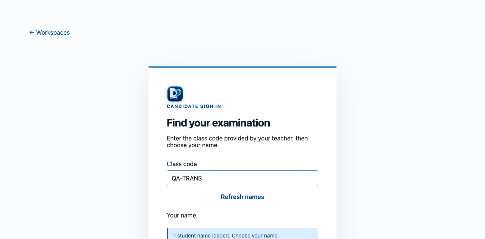
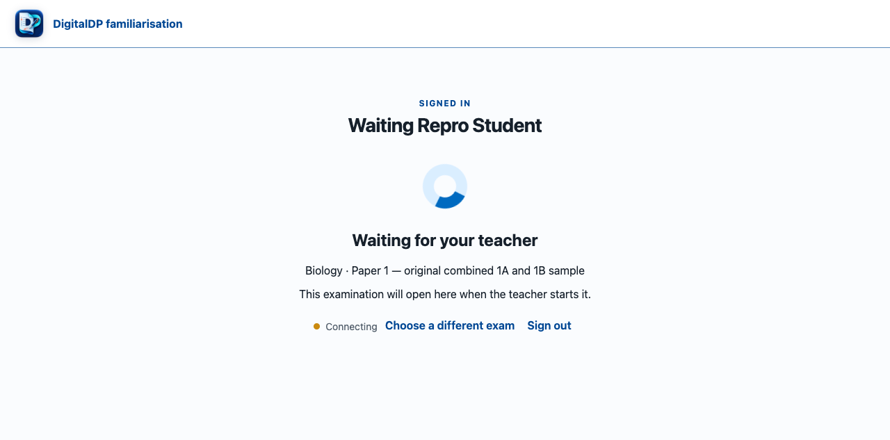
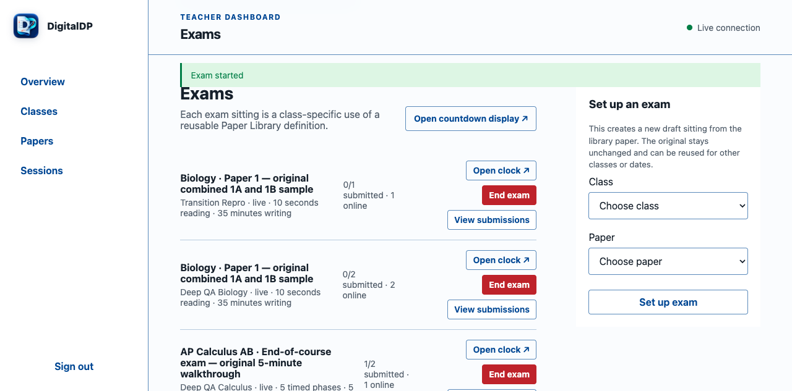
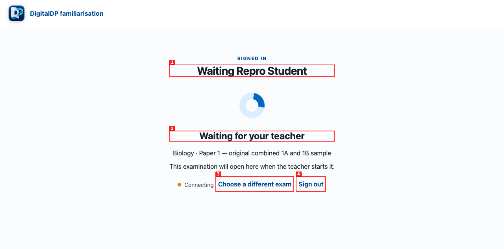

# DigitalDP deep release-candidate QA

> **Follow-up:** both application defects recorded below were corrected and retested in `../2026-09-04-framework-alignment/report.md`. The distribution blockers in this report still apply.

| Field | Value |
|---|---|
| Date | 2026-09-04 |
| Source app | `http://127.0.0.1:9166` with a fresh temporary SQLite database |
| Compiled app | Fresh arm64 binary at `http://127.0.0.1:9167` with a separate fresh data directory |
| Release candidate | `0.1.0-demo.5` working tree |
| Browser | Google Chrome 152 via agent-browser 0.26.0 |
| Scope | Automated suite, clean data, rosters, teacher/student/clock flows, concurrent exams, phase timing, listening controls, recovery, print/PDF, responsive and keyboard checks, network boundaries, and compiled runtime |

## Verdict

The candidate is **not ready to publish as a release yet**.

The main application is broadly functional and the tested data paths are sound, but one high-severity classroom-flow defect remains: a student already in a paper's waiting room does not automatically enter when the teacher starts that sitting. Reloading and selecting the now-live sitting works, but that is not acceptable as the normal demo flow.

A low-severity phone-width overflow also remains on teacher paper-library rows. It does not occur at tablet or desktop widths and does not affect the 375 px student examination layout.

Separately, the release cannot be distributed yet: the current Mac has no Developer ID/notary credentials, the protected builder correctly refuses to emit an unnotarized Mac archive, Windows and Linux have only been cross-compiled rather than launched on native machines, and the `demo.5` working tree has not been committed, tagged, or published to GitHub.

## Issue summary

| Severity | Count |
|---|---:|
| Critical | 0 |
| High | 1 |
| Medium | 0 |
| Low | 1 |
| **Total** | **2** |

## ISSUE-001: A waiting student does not enter when the teacher starts the exam

| Field | Value |
|---|---|
| Severity | High |
| Category | Functional / live coordination |
| Student URL | `http://127.0.0.1:9166/student` |
| Repro video | [issue-001-waiting-room-transition.webm](videos/issue-001-waiting-room-transition.webm) |

**Expected:** a signed-in student who has joined a draft sitting's waiting room should move into the examination automatically when the teacher presses **Start exam**.

**Observed:** the teacher start request succeeds with HTTP 200 and the student's `/api/student/state` response changes to `status: "live"`, but the visible page remains on **Waiting for your teacher** with **Connecting**. This reproduced for all three initial concurrent students and again in an isolated class/sitting. A student who reloads and selects the same sitting after it is live enters successfully.

**Reproduction:**

1. Load class `QA-TRANS` and choose `Waiting Repro Student`.
   
2. Join the ready Biology sitting and remain in its waiting room.
   
3. In the teacher dashboard, start that exact sitting; the request returns HTTP 200.
   
4. Wait six seconds. The student's API reports `live` / `Writing time`, but the page still displays **Connecting**.
   

**Probable cause:** `loadState()` uses the presence of any element with the current `data-session-id` to decide whether the live examination is already rendered. The waiting shell has that same attribute, so the live branch at `public/student.js:380-381` is skipped. The branch needs to distinguish an actual exam shell from the waiting shell.

**Workaround used in QA:** reload the student page, choose the live sitting, and enter it again. This preserved the candidate identity and allowed the rest of the examination tests to continue.

## ISSUE-002: Teacher paper-library rows overflow at a 375 px viewport

| Field | Value |
|---|---|
| Severity | Low |
| Category | Responsive layout |
| Screenshot | [admin-dashboard-mobile-375.png](screenshots/admin-dashboard-mobile-375.png) |

**Expected:** the teacher dashboard should not create horizontal page scrolling on a narrow phone viewport.

**Observed:** at 375 px, the document is 452 px wide. Long duration labels and their **Export** links extend past the right edge. The widest measured overrun was about 77 px. At 768 px and 1,440 px the document width equals the viewport.

**Probable cause:** paper rows use the shared horizontal flex rule at `public/styles.css:1215-1223`, but the `max-width: 720px` column fallback at `public/styles.css:3170-3175` does not include `.paper-list li`.

This is low severity because the teacher dashboard is primarily a laptop/desktop surface, but it is a genuine responsive defect.

## Release-state blockers

- `bun run release:build` exits before building with: `macOS releases require DIGITALDP_MAC_SIGN_IDENTITY. DigitalDP will not create another unnotarized Mac download.` This guard is correct.
- The Mac keychain contains no valid code-signing identities, and no notary environment/profile is configured.
- A direct Git ref check showed GitHub `main` and local `HEAD` both at `7efdfbf7005ab2deb27b092071d41665ece05923` (`Require notarized macOS releases`). The current `demo.5` work is entirely uncommitted. Remote tags stop at `v0.1.0-demo.4`; no `v0.1.0-demo.5` tag exists.
- GitHub release-asset metadata could not be queried because the saved `gh` credential is invalid. The direct SSH ref check succeeded, so branch and tag state above is current; asset contents are not claimed as verified.
- Windows x64 and Linux x64 binaries cross-compiled successfully and have the correct PE32+/ELF formats, but native launch/install checks still need Windows and Linux machines.

## Passed automated verification

- `bun test --timeout 15000` passed twice: **205 tests, 0 failures, 1,953 assertions across 29 files**.
- `bun run check`: TypeScript check passed.
- `bun run samples:build`: rebuilt **44** editable manifests and portable papers.
- Sample inventory: 34 IB-oriented papers, 2 Cambridge IGCSE Mathematics papers, 2 Pearson Edexcel International GCSE Mathematics A papers, and 6 AP papers.
- `git diff --check`: passed.
- Private-resource check: no PDF/audio/image source files under `resources/` are tracked; 37 binary items are ignored. Only indexes, provenance and checksum records remain eligible for Git.
- No production browser asset contains the previously failing hard-coded `http://localhost:9148/exam.js` URL; module imports are root-relative.

The automated suite covers manifests and uploads, portable paper round trips, static module completeness, roster CSVs, Unicode and formula-cell handling, database migrations and archive behavior, independent repeated sittings, phase timing and response locks, ink limits/eraser/history/backgrounds, audio tickets and atomic two-play enforcement, countdown logic, network authority checks, context-menu suppression, print wiring, and release-runtime port/data rules.

## Passed teacher workflows

- Seeded 44 papers into a clean database; later imports/builder saves increased only that disposable database.
- Imported four classes and five students from CSV, including `Renée Liu`, `Zoë Chen`, an empty class, and candidate-specific extra time.
- Exported the active roster and confirmed Unicode, empty-class rows and extra-time values survived the round trip. Export SHA-256: `dc1e9b945b6064a4890501c2bc1545c6fa9d4e00ae7ad52851681196f5a095c1`.
- Set up and started Biology, AP Calculus AB and AP English Language sittings for three separate classes at the same time. The dashboard reported three independent live sessions and separate online/submitted counts.
- Set up the same AP Calculus paper a second time for the same class. The new ready sitting and the previous completed sitting remained separate; prior completion did not block the new sitting.
- Imported a valid `paper.json` plus its 263 KB MP3 as one listening paper package.
- Exported and re-imported a Cambridge paper as a portable `.digitaldp-paper`. The package SHA-256 is `9c36dde495e4e9f93fb2db4ea9f4e0fe96b2d62a83ef21d3f5fbb96511c070d2`.
- Rejected a deliberately damaged portable paper with a clear message and no paper-count change.
- Built and saved a custom AP Biology hybrid paper with editable 42 maximum marks, 20/22-mark questions, section assignments and a scrollable live preview (`448 px` viewport over `1,953 px` content).
- Builder controls changed appropriately between IB, Cambridge, Pearson, AP and custom profiles. The teacher-facing builder and printable output contain no source/rights-status field.

## Passed student, timing and phase workflows

- Student sign-in uses class code plus a teacher-maintained name list; no PIN is shown or sent.
- A ten-second test reading phase locked response writes with HTTP 409. The same write succeeded after the reading phase changed to writing.
- AP Calculus phase coverage was exercised across Section I Part A, Part B, the monitored break, Section II Part A and Part B.
  - Only the active section's questions were shown.
  - The monitored break showed no question cards and rejected response writes with HTTP 409.
  - Attempts to alter a closed section also returned HTTP 409.
  - Calculator guidance changed between `not permitted` and `approved graphing calculator required` at the correct boundaries.
  - The room clock used standard timing while the +25-minute candidate retained candidate-specific time.
- Typed answers, selected responses, long answers, flags and the separate notepad autosaved and survived reload/restart.
- The submit controls are present in both the top tools and examination footer and route through confirmation.
- Text selection/highlighting works. Yellow highlighting produced `<mark data-color="yellow">`; **Clear highlights** removed it.
- Canvas checks covered real pointer drawing, stationary-click suppression, Undo, Redo, eraser, adding pages to the 12-page cap, disabling **Add page** at the cap, teacher-default background, warned student override, restore-default, and typed fallback.
- Changing a canvas background or page preserved work.
- Right-click/context-menu events were prevented on both teacher and student surfaces without blocking ordinary selection or input.

## Passed controlled-listening checks

- A real 89.73-second MP3 was imported and downloaded through the authenticated ticket path.
- Native audio controls are hidden; the visible UI offers only **Start first listen**, volume, progress and status.
- While the first listen was active, a forced speed change returned to `1×`, a seek from 00:00 to 00:50 returned to the last valid position, and a forced pause resumed the same listen without incrementing the counter.
- The transition from first to final listen and then to **Both listens completed** was verified. A direct third-ticket request returned HTTP 409: `Both audio listens have been used`.
- Headless Chrome did not advance its audio clock on this Mac. Therefore natural audible completion was not claimed: the two `ended` events were triggered after separately verifying the playback controls and server ticket/count behavior. A human listening pass on a normal headed browser remains required.

## Passed clock checks

- An authenticated clock page listed all ready/live/ended sittings and selected an explicitly requested session rather than another live exam.
- Before start, a draft sitting showed `Ready exam · waiting for Start` and `--:--:--`; the countdown did not begin merely because students had joined.
- The clock displayed the current section, full room schedule, permitted tools, next transition, standard-time completion, and the warning that candidate extra time may still be running.
- Student names remained editable independently of candidate records. Replacing the list with `Candidate A / Candidate B / Seat 12` changed the projected display only.
- The student connection URL remained visible in the projected area when controls were shown or hidden.
- At 1,280 × 720 the clock had no horizontal overflow and produced no browser-console errors.

## Passed print/PDF checks

- Opened the completed Biology class results and exercised the synchronous native print action.
- Generated a print-media PDF for one candidate and independently inspected it with `pdfinfo`, `pdftotext` and rendered-page images.
- The final evidence PDF is tagged, three pages, and includes:
  - candidate name/code and class;
  - assessment/paper/timing metadata and editable maximum marks;
  - all six questions, mark allocations and saved answers;
  - question-scoped source data;
  - a square-grid handwritten page with a vector ink path;
  - typed working;
  - the separate candidate notepad;
  - page numbers and an end-of-response footer.
- The text contains no source-status or rights-status field.
- The evidence PDF is [renee-liu-biology-with-ink.pdf](pdfs/renee-liu-biology-with-ink.pdf), with rendered ink/notepad evidence in [print-ink-page-3.png](screenshots/print-ink-page-3.png).
- The vector stroke in the final PDF was inserted into the disposable database as a controlled fixture after real browser drawing/undo/redo/eraser behavior had already been tested. This isolates print rendering without implying that the synthetic stroke was hand-drawn by the candidate.

## Passed resilience, privacy and security checks

- Aborting the autosave request produced `Offline — saved on this device`; restoring the route and editing again produced `Saved` and persisted the recovered response.
- Stopped and restarted the source server against the same database. Six classes, seven students, 47 test-library papers, six sittings, answers, notepad and ink all remained intact.
- `PRAGMA integrity_check` returned `ok`; `PRAGMA foreign_key_check` returned no rows.
- Unauthenticated teacher-state request: HTTP 401.
- Wrong request authority: HTTP 421.
- Cross-origin teacher mutation: HTTP 403.
- Unauthenticated audio asset: HTTP 401.
- The student shell's GET response includes CSP, `X-Content-Type-Options: nosniff`, `Referrer-Policy: no-referrer`, `X-Frame-Options: SAMEORIGIN`, a restrictive permissions policy, and `Cache-Control: no-cache`.
- Test cookie jars are ignored by Git through `research/qa/**/logs/*.cookie`.

## Passed responsive and accessibility-oriented checks

- Keyboard-only teacher sign-in succeeded with Tab, typing and Enter.
- The student accessibility dialog exposed labelled controls for text magnification, colour/contrast, typeface and spacing.
- Maximum magnification + high contrast + dyslexia-friendly typeface + maximum spacing remained usable at 375 × 812 with no horizontal page overflow.
- Preferences persisted in local storage. The session auto-submitted before a second examination mount, so restoration into a newly mounted exam remains covered by code/tests rather than this browser pass.
- Student exam controls and form fields had accessible names in Chrome's accessibility tree.
- Teacher sign-in at 375 px, dashboard at 768 × 1,024, dashboard at 1,440 × 900, student exam at 375 × 812, and clock at 1,280 × 720 were captured.

## Passed compiled-runtime checks

- Cross-compiled current sources as:
  - Mach-O 64-bit arm64;
  - PE32+ Windows x64;
  - ELF 64-bit Linux x64.
- Launched the arm64 executable directly with `DIGITALDP_OPEN_BROWSER=0` and no Bun/Node process wrapper.
- A fresh application-data directory seeded exactly 44 papers and no classes, passed SQLite integrity checking, and remained separate from source/development data.
- Restarting the same binary/data directory reported `SEEDED 0 ... unchanged 44`; papers were not duplicated.
- The standalone runtime detected the actual `en0` private address. Enabling it through the teacher API displayed `http://192.168.0.139:9167/student`.
- A self-connection over that real private interface returned HTTP 200 for `/student` while `/admin` and `/api/admin/state` returned HTTP 403. This verifies the software boundary, though it is not a substitute for a second-device/VLAN test.
- On restart, the prior interface remained preselected but classroom sharing returned to computer-only mode, preventing accidental exposure.

## Explicitly unverified

- Real student device over the school's actual Wi-Fi/VLAN, including firewall and client-isolation behavior.
- Real stylus/Apple Pencil/Windows Pen hardware and physical eraser button.
- Natural audible completion and audio quality through speakers/headphones in a headed browser.
- Native Windows and Linux launch, OS firewall prompts, installer reputation warnings and desktop integration.
- Signed/notarized/stapled macOS `.app` and Gatekeeper launch from a clean download.
- GitHub release-asset contents, because the saved `gh` login is invalid.
- Long-duration soak under a full classroom load; concurrency was validated functionally with three simultaneous sittings, not with dozens of real devices.
- Formal WCAG conformance audit with axe/pa11y and assistive-technology users; this pass used keyboard interaction, accessibility-tree inspection and responsive stress testing.

## Exploratory recordings that are not defects

Some retained videos/screenshots have issue-like filenames from exploratory attempts. They are not included in the issue count:

- The apparent live-exam ejection was not reproducible and coincided with agent-browser session resets/blank pages.
- Text highlighting was ultimately confirmed working; the `issue-002-text-highlighting*` recordings show exploratory automation attempts, not a product failure.

## Recommended order before release

1. Fix ISSUE-001 and add a regression test that starts with an already-rendered waiting shell.
2. Fix ISSUE-002 by including `.paper-list li` in the narrow column fallback; retest at 320, 375 and 390 px.
3. Repeat the focused browser flow: waiting room → teacher start → automatic exam mount, with three simultaneous sittings.
4. Run a real headed-browser listening pass and a second-device LAN pass.
5. Run the compiled Windows and Linux builds on native test machines.
6. Configure Developer ID and notary credentials, then run the protected release builder and verify `codesign`, `stapler`, Gatekeeper and archive checksums.
7. Review the working-tree diff, commit only approved source/research/QA material, create `v0.1.0-demo.5`, publish release assets, and verify every uploaded checksum from a fresh download.
